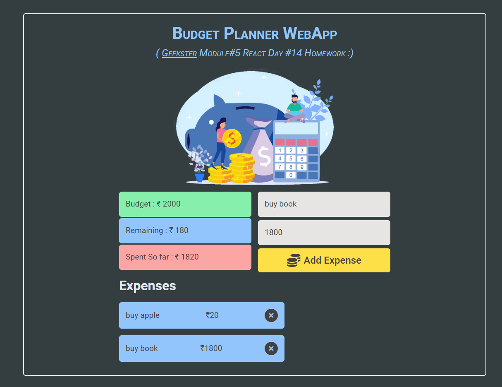

# Module#5 React Day #14 Homework: Budget Planner WebApp


## Hosted Version of the Project:
[m5react-day-14-homework-budget-planner-webapp](https://m5react-day-14-homework-budget-planner-webapp.vercel.app/)

## Project Overview:
In this project, I've created a Budget Planner WebApp using ReactJS and the Context API. Managing personal finances is crucial, and this WebApp will provide users with a user-friendly platform to set their budgets, track expenses, and monitor their spending. By leveraging the Context API in React, i've efficiently manage state across different components, making the budget planning process intuitive and efficient.

## Objectives:
+ Develop a user-friendly Budget Planner WebApp using ReactJS.
+ Enable users to set budgets, track expenses, and monitor their spending.
+ Utilize the Context API in React for efficient state management across components.
+ **Budget Setting:** Implement features that allow users to set budgets for different expense categories (e.g., groceries, utilities). Use the Context API to manage and share budget data across components.
+ **Expense Tracking:** Create a mechanism for users to add and categorize expenses.
Track and display expenses within their respective budget categories.
+ **Financial Monitoring:** Implement features that help users monitor their overall financial health, such as remaining budget amounts and expense summaries.


## How to install and run in yours local machine
```bash
npm install
npm run start
```

## Tech. Stack Used:
+ [React](https://react.dev/)
+ [TailwindCSS](https://tailwindcss.com/)
+ [Google Fonts](https://fonts.google.com/)
+ [Font Awesome](https://fontawesome.com/icons/)

## Author
[Abhishek kumar](https://www.linkedin.com/in/alex21c/), ([Geekster](https://geekster.in/) MERN Stack FS-14 Batch)


